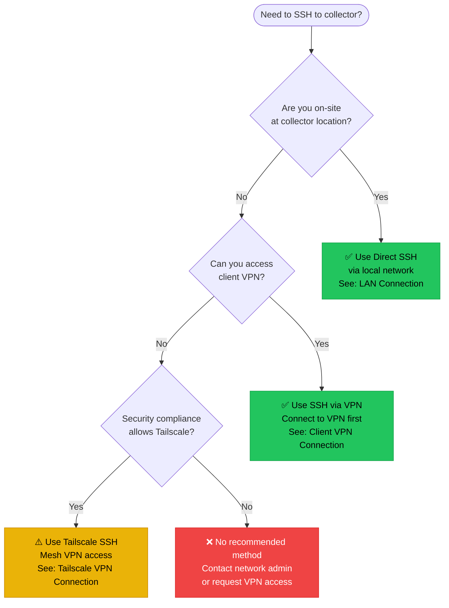

# Common Issues

Quick reference for troubleshooting the most frequently encountered problems.

## Issue Quick Reference

| Symptom | Likely Cause | Quick Fix |
|---------|--------------|-----------|
| Pi doesn't power on | Switch port 802.3af-only, or PoE budget exhausted | Verify 802.3at support, test with USB-C PSU |
| Collector offline in Auvik | Network issue, Pi crash, SD card failure | Check Tailscale status, attempt SSH |
| No device discovery | SNMP not enabled, wrong credentials, VLAN isolation | Verify SNMP config on devices, check routing |
| High CPU/memory | Site exceeds Pi capacity | Review device/interface counts, scale to VM |
| Tailscale not connecting | Firewall blocking outbound | Verify HTTPS to tailscale.com allowed |
| SD card corruption | Write wear-out or power loss | Re-flash from golden image |

## Diagnostic Commands

### System Health

```bash
# Overall status
uptime
free -h
df -h

# Service status
systemctl status auvik-collector
systemctl status tailscaled

# Network
ip addr show
ip route show
ping 8.8.8.8
curl -I https://auvik.com
```

### Auvik Collector

```bash
# Service logs
journalctl -u auvik-collector -f

# Service control
sudo systemctl restart auvik-collector
sudo systemctl stop auvik-collector
sudo systemctl start auvik-collector
```

### Tailscale

```bash
# Status
tailscale status
tailscale netcheck

# Reconnect
sudo tailscale up --ssh
```

## SSH Connection Method Selection

Use this decision tree to select the appropriate SSH connection method based on your location and available network access.



**Legend:**
- ✅ **Green (Recommended)** - Primary recommended approach for this scenario
- ⚠️ **Yellow (Acceptable)** - Acceptable alternative, may have security considerations
- ❌ **Red (Avoid)** - Not recommended, requires alternative solution

**Quick reference:**
- **On-site access** → Direct SSH is fastest and most reliable
- **Remote with VPN** → VPN tunnel provides secure corporate access
- **Remote without VPN** → Tailscale offers mesh VPN (verify security policy first)
- **No VPN or Tailscale** → Contact network administrator for access options

## Escalation Path

If standard troubleshooting doesn't resolve the issue:

1. **Check Auvik support docs** — [support.auvik.com](https://support.auvik.com)
2. **Review Tailscale status** — [status.tailscale.com](https://status.tailscale.com)
3. **Check Pi forums** — [forums.raspberrypi.com](https://forums.raspberrypi.com)
4. **Internal escalation** — Document issue and escalate to senior team

## SSH Connection Scenarios

Multiple methods exist for accessing collectors remotely. Choose the appropriate method based on your network configuration and security requirements.

### 1. LAN (Local Network) Connection

Direct SSH access when on the same local network as the collector.

**Prerequisites:**
- Collector IP address (check router DHCP, or use `arp-scan`)
- SSH access enabled on collector
- Network connectivity to collector subnet

**Connection command:**

```bash
ssh viyu@<collector-ip>
# Example:
ssh viyu@192.168.1.100
```

**Common errors and solutions:**

| Error | Cause | Solution |
|-------|-------|----------|
| `Connection refused` | SSH service not running | Verify service: `systemctl status sshd` |
| `Connection timed out` | Firewall blocking port 22, or wrong IP | Check firewall rules, verify IP with `ping` |
| `Permission denied (publickey)` | Key authentication failed | Use password auth: `ssh -o PreferredAuthentications=password viyu@<ip>` |
| `Host key verification failed` | SSH key changed (re-imaged Pi) | Remove old key: `ssh-keygen -R <collector-ip>` |

**Verification:**

```bash
# Test connectivity
ping <collector-ip>

# Verify SSH port is open
nc -zv <collector-ip> 22

# Check collector hostname
ssh viyu@<collector-ip> hostname
```

### 2. Tailscale VPN Connection

Remote access via Tailscale mesh VPN network.

**Prerequisites:**
- Tailscale installed on your workstation
- Collector enrolled in Tailscale network
- Authenticated to same Tailscale account

**Connection command:**

```bash
# Connect using Tailscale hostname
ssh viyu@<collector-hostname>

# Or use Tailscale IP (100.x.x.x range)
ssh viyu@100.64.0.5

# Check Tailscale status first
tailscale status
```

**Common errors and solutions:**

| Error | Cause | Solution |
|-------|-------|----------|
| `Could not resolve hostname` | Tailscale not running or collector offline | Run `tailscale status`, verify collector listed |
| `Connection timed out` | Tailscale SSH not enabled | Enable on collector: `sudo tailscale up --ssh` |
| `Network is unreachable` | Tailscale daemon not running | Start service: `sudo systemctl start tailscaled` |
| `No route to host` | Subnet routing or firewall issue | Check routes: `tailscale status --peers` |

**Verification:**

```bash
# Check Tailscale connectivity
tailscale ping <collector-hostname>

# List all Tailscale devices
tailscale status

# Verify Tailscale IP
tailscale ip -4
```

**Troubleshooting Tailscale SSH:**

```bash
# Enable SSH on collector (requires physical/console access)
sudo tailscale up --ssh

# Check Tailscale logs
sudo journalctl -u tailscaled -f

# Force reconnection
sudo tailscale down
sudo tailscale up --ssh
```

### 3. SSH Jump Host (ProxyJump)

Access collectors behind firewalls using an intermediate jump/bastion host.

**Prerequisites:**
- SSH access to jump host
- Jump host can reach collector network
- SSH keys configured on jump host and collector

**Connection methods:**

**Option A: Command-line ProxyJump**

```bash
# Single jump host
ssh -J jumpuser@jumphost viyu@<collector-ip>

# Multiple jump hosts
ssh -J jumpuser@jump1,jumpuser@jump2 viyu@<collector-ip>

# With specific ports
ssh -J jumpuser@jumphost:2222 viyu@<collector-ip>
```

**Option B: SSH Config file**

```bash
# Add to ~/.ssh/config
Host jump-host
    HostName jumphost.example.com
    User jumpuser
    Port 22

Host collector-*
    User viyu
    ProxyJump jump-host

# Then connect simply:
ssh collector-192.168.1.100
```

**Option C: ProxyCommand (legacy)**

```bash
# Using ProxyCommand
ssh -o ProxyCommand="ssh -W %h:%p jumpuser@jumphost" viyu@<collector-ip>

# In ~/.ssh/config:
Host collector-*
    User viyu
    ProxyCommand ssh -W %h:%p jumpuser@jumphost
```

**Common errors and solutions:**

| Error | Cause | Solution |
|-------|-------|----------|
| `Jump host authentication failed` | Can't authenticate to jump host | Verify jump host credentials/keys first |
| `Channel open failed` | Jump host can't reach collector | Test from jump host: `ssh jumpuser@jumphost`, then `ssh viyu@<collector-ip>` |
| `Permission denied on final hop` | Collector authentication failed | Ensure SSH key forwarding: `ssh -A -J ...` |
| `Connection closed by jump host` | Jump host policy/timeout | Check jump host SSH config, increase timeout |

**Verification:**

```bash
# Test jump host access first
ssh jumpuser@jumphost

# Test from jump host to collector
ssh jumpuser@jumphost "ssh viyu@<collector-ip> hostname"

# Test full chain
ssh -J jumpuser@jumphost viyu@<collector-ip> "uptime"
```

### 4. Client VPN Connection

Access via corporate or site-to-site VPN.

**Prerequisites:**
- VPN client installed and configured
- Connected to VPN with access to collector subnet
- DNS resolution configured (if using hostnames)

**Connection command:**

```bash
# Connect to VPN first (example using OpenVPN)
sudo openvpn --config /path/to/client.ovpn

# Then SSH to collector via private IP
ssh viyu@<collector-private-ip>

# Or using hostname (if DNS configured)
ssh viyu@collector.internal.domain
```

**Common errors and solutions:**

| Error | Cause | Solution |
|-------|-------|----------|
| `No route to host` | VPN not connected or wrong route | Verify VPN: `ip route show`, check VPN status |
| `Connection timed out` | VPN firewall blocking SSH | Check VPN ACLs, verify SSH allowed through VPN |
| `Could not resolve hostname` | DNS not working through VPN | Use IP instead, or check DNS config: `cat /etc/resolv.conf` |
| `Network is unreachable` | VPN routes not pushed | Check routes: `ip route \| grep <collector-subnet>` |

**Verification:**

```bash
# Verify VPN connection
ip addr show tun0  # or tap0, depending on VPN type

# Check VPN routes
ip route show | grep <collector-subnet>

# Test connectivity to collector subnet
ping <collector-private-ip>

# Verify DNS (if using hostnames)
nslookup collector.internal.domain

# Test SSH connection
ssh viyu@<collector-private-ip> "echo 'VPN SSH working'"
```

**VPN-specific debugging:**

```bash
# Check VPN interface
ifconfig | grep -A 5 tun0

# Verify routing table
netstat -rn | grep <collector-subnet>

# Test without DNS
ssh viyu@<collector-ip> -v  # verbose mode for debugging

# Check if split-tunnel or full-tunnel
ip route show default
```

### 5. SSH Port Forwarding

Access collectors through port forwarding (local, remote, or dynamic).

**Prerequisites:**
- SSH access to an intermediate host that can reach collector
- Understanding of which port forwarding type is needed
- Port forwarding not blocked by firewall

**Port forwarding types:**

**Option A: Local Port Forwarding**

Forward local port to collector through intermediate host.

```bash
# Forward local port 2222 to collector's SSH port
ssh -L 2222:<collector-ip>:22 user@intermediate-host

# In another terminal, connect via localhost
ssh -p 2222 viyu@localhost

# Alternative: Background process
ssh -fNL 2222:<collector-ip>:22 user@intermediate-host
ssh -p 2222 viyu@localhost
```

**Option B: Remote Port Forwarding**

Forward remote port back to your workstation (reverse tunnel).

```bash
# On your workstation: forward port 2222 on intermediate host to local SSH
ssh -R 2222:localhost:22 user@intermediate-host

# Then from intermediate host, connect back to your workstation
ssh -p 2222 user@localhost
```

**Option C: Dynamic Port Forwarding (SOCKS Proxy)**

Create a SOCKS proxy for flexible routing.

```bash
# Create SOCKS proxy on local port 1080
ssh -D 1080 user@intermediate-host

# Configure your SSH client to use the proxy
ssh -o ProxyCommand='nc -x localhost:1080 %h %p' viyu@<collector-ip>

# Or use proxychains
proxychains ssh viyu@<collector-ip>
```

**SSH Config for Port Forwarding:**

```bash
# Add to ~/.ssh/config
Host tunnel-host
    HostName intermediate-host.example.com
    User tunneluser
    LocalForward 2222 <collector-ip>:22

# Or with dynamic forwarding
Host socks-tunnel
    HostName intermediate-host.example.com
    User tunneluser
    DynamicForward 1080
```

**Common errors and solutions:**

| Error | Cause | Solution |
|-------|-------|----------|
| `bind: Address already in use` | Local port already bound | Choose different port, or kill existing process: `lsof -ti:2222 \| xargs kill` |
| `channel 2: open failed: connect failed` | Intermediate host can't reach collector | Verify from intermediate host: `nc -zv <collector-ip> 22` |
| `Permission denied (publickey)` | Authentication to intermediate host failed | Verify SSH keys/password for intermediate host |
| `Warning: remote port forwarding failed` | Insufficient permissions for remote forwarding | Check `GatewayPorts` in intermediate host's `/etc/ssh/sshd_config` |

**Verification:**

```bash
# Verify local port forwarding is active
netstat -an | grep 2222
# or
lsof -i :2222

# Test forwarded connection
ssh -p 2222 viyu@localhost "hostname"

# For dynamic forwarding, test SOCKS proxy
curl --socks5 localhost:1080 http://<collector-ip>

# Verify tunnel is established
ssh user@intermediate-host "netstat -an | grep 2222"
```

**Troubleshooting Port Forwarding:**

```bash
# Check if SSH tunnel is running
ps aux | grep "ssh -L"

# Kill hung tunnel
pkill -f "ssh -L 2222"

# Restart with verbose output for debugging
ssh -vL 2222:<collector-ip>:22 user@intermediate-host

# Keep tunnel alive with connection options
ssh -o ServerAliveInterval=60 -o ServerAliveCountMax=3 -L 2222:<collector-ip>:22 user@intermediate-host

# Monitor tunnel activity
ssh -L 2222:<collector-ip>:22 user@intermediate-host "tail -f /var/log/auth.log"
```

**Best Practices:**

- **Persistent tunnels:** Use `autossh` for auto-reconnecting tunnels:
  ```bash
  autossh -M 0 -fNL 2222:<collector-ip>:22 user@intermediate-host
  ```

- **Security:** Bind forwarded ports to localhost only (default) to prevent unauthorized access:
  ```bash
  ssh -L 127.0.0.1:2222:<collector-ip>:22 user@intermediate-host
  ```

- **Multiple forwards:** Chain multiple port forwards in one command:
  ```bash
  ssh -L 2222:<collector1-ip>:22 -L 2223:<collector2-ip>:22 user@intermediate-host
  ```

## Detailed Troubleshooting

For detailed troubleshooting of specific issues, see:

- [Pi Not Powering On](/docs/troubleshooting/pi-not-powering)
- [Collector Offline](/docs/troubleshooting/collector-offline)
- [SD Card Failure](/docs/troubleshooting/sd-card-failure)
